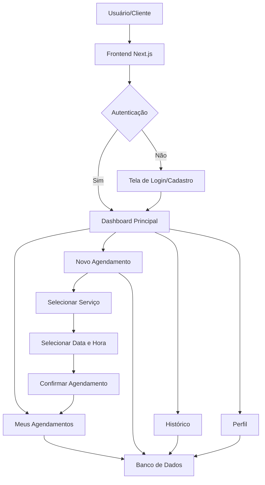

# Fluxo e Arquitetura do Sistema

```mermaid
graph TD
    A[Usuário/Cliente] --> B[Frontend Next.js]
    B --> C{Autenticação}
    C -- Sim --> D[Dashboard Principal]
    C -- Não --> E[Tela de Login/Cadastro]
    E --> D
    
    D --> F[Meus Agendamentos]
    D --> G[Novo Agendamento]
    D --> H[Histórico]
    D --> I[Perfil]
    
    G --> J[Selecionar Serviço]
    J --> K[Selecionar Data e Hora]
    K --> L[Confirmar Agendamento]
    L --> F
    
    F --> M[Banco de Dados]
    G --> M
    H --> M
    I --> M
```
